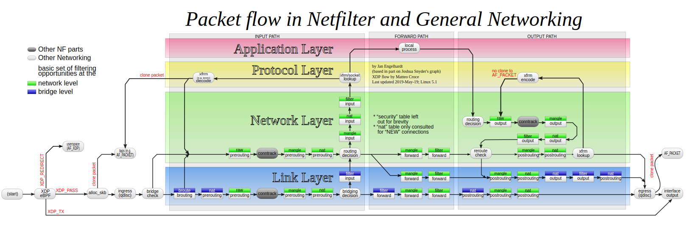
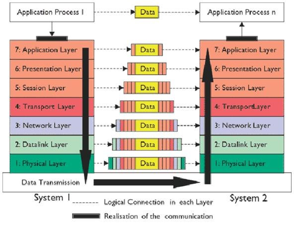

# OSI Modeli ve Iptables Chain Yapısı

Iptables'ın ne tür bir firewall anlamaya çalışalım.

Iptables üzerinde temelde [üç farklı tablo](https://www.digitalocean.com/community/tutorials/a-deep-dive-into-iptables-and-netfilter-architecture) bulunmaktadır.

1. **Filter**: firewall denildiğinde aklımıza gelecek olan aslında filter'dır. Trafiğe izin verilip verilmeyeceğini belirleyen filter'dır. INPUT, FORWARD, OUTPUT zincirleri bulunur.
2. **NAT**: PREROUTING, OUTPUT, POSTROUTING zincirleri bulunur.
   1. **SNAT** (Source Nat): İçerideki makinelerı dışarı çıkarmaktır. NAT denildiğinde ilk  akla gelen NAT tipi budur.
   2. **DNAT** (Destination Nat): dışarıdaki makinelerin içeriye gelişini ifade eder. Mesela bir web sitesinin yayına verilmesi esnasında firewall dan geçmesi buna örnektir. İnternetten/dışarıdan bir makine iç network'teki web sunucularında bir web sitesini talep ettiğinde firewall'ın belirli verilere bakarak içerideki web sunucuna yönlendirmesi buna örnektir. 
3. **Mangle**: Paket değişikliği gereken durumlarda kullanılır. PREROUTING, OUTPUT, INPUT, POSTROUTING, FORWARD zincirleri bulunur.

Ebtables, iptables ve firewall kavramlarını OSI katmanları üzerinden anlamaya çalışalım.

Kaynak: [Wiki](https://en.wikipedia.org/wiki/Iptables)

### OSI Katmanları

EbTables iptables'a göre daha alt seviyede yani Layer 3'ün altında Layer 2'de (data link) kullar yazmamızı sağlar.  Örneğin sadece belli bir MAC adresinden gelen paketlere içeride 80 portundan geçişine izin ver gibi.

Iptables ise layer 3 katmanına kural yazmamızı sağlar. Yani temelde böyledir yoksa şuan özellikle firewall'lar layer 7'ye kadar kural yazabilir durumdadırlar (WAF).

### Segment, Package ve Frame Kavramları

Transport katmanından itibaren artık yazılımdan fiziksel cihazlara doğru geçiş başlar. Bu geçişle birlikte

- Transport katmanında segmentlerden
- Network katmanında paketlerden
- ve data link katmanında frame'lerden bahsedilir.

iki sistem arasında veri geçişi esnasında paketler her network katmanında yeni verilerle sarmalanarak diğer katmana geçirilir.

Katmanlarda kullanılan araçlar

- Application Katmanı: Process
- Presentation Katmanı: Code
- Session Katmanı: Socket
- Transport Katmanı : Port
- Network Katmanı: Router, ethernet
- Data Link Katmanı: Ethernet
- Physical Katmanı: NICs

Firewall'lar mac'den mac'e, portdan porta ve IP'den IP'ye veri taşırlar.

- Source mac (smac) <--------------> destination mac (dmac)

- Source ip (sip) <------------------> destination ip (dip)

- Source port (sport) <------------------> destination port (dport)

Kaynak: [Wikipedia](https://en.wikipedia.org/wiki/OSI_model)

### Iptables Chain Yapısı ve İş Akışı

Iptables için yazacağımız kuralları iptables ve üzerindeki tablolara yazarız. Yukarıda bu tablolardan bahsetmiştik. Bu tablolarda kuralları birbiri ardına ve birbirine bağlı belli bir akış üzerinde çalıştırır. Bunun için kurallarımızı tablolar içindeki chain (zincir)'lere yazarız. Örneğin INPUT, OUTPUT, FORWARD vb.

Aşağıda yazılan kulların hangi sırada çalıştığı görülebilir.

Resimdeki renkli kutular bizim kurallarımızı yazacağımız chain'leri gösteriyor.

Gelecek yazılarımızda bu iş akışı üzerinde farklı noktalara kurallar yazacağız. Amacımız ezberlemek değil bütün zincirlere kural yazmaktan daha çok mantığını anlamaya çalışacağız.

