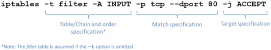

# Tek Kaynağı Bloklamak


Listedeki örnekleri yapıyor olacağız

- Sadece Sunucu1 SunucuFirewall üzerindeki servislere erişemesin (tek bir ip) diğer sunucular erişebilsin
- 172.24.10.0 network'ü SunucuFirewall üzerindeki servislere erişemesin (tek network) diğer network'ler erişebilsin
- Bütün network'ler engellensin

Peki bu kuralların yönü nedir? yukarıdaki şekle bakacak olursak bütün kuralları firewall üzerinde yazacağız bu durumda firewall makinası üzerinde INPUT direction kuralı yazmış olacağız.

### Tek IP İçin INPUT CHAIN Kuralı Ekleme

```
iptables -t filter -A INPUT -s 172.24.10.11 -j DROP
```


- t: "type of firewall" burada filter tipinde firewall olduğu belirtilmiş. bu arada -t parametresi belirtilmezse default olarak filter kullanılır 
- A : Add/APPEND demektir. INPUT chain'e source ip si .... olan kural ekle demektir.
- s: source demektir
- j : jump demektir. Yapılacak hareketi belirtir. Örneğin burada gelen talebi düşür cevap verme deniyor.

Bu komutu SunucuFirewall makinasında çalıştırdığımız için kural şöyle okunur. SunucuFirewall makinasına kaynak ip'si 172.24.10.11 olan cihazdan gelen (INPUT) tüm paketleri (istekleri) düşür yani yok say.

Kuralı çalıştırıp sonuçları inceleyelim. En üstte görüleceği üzere 172.24.10.11 (Sunucu1) makinasından gelen tüm paketler DROP edilecek diyor.

```shell
iptables -L -n

#sonuç

Chain INPUT (policy ACCEPT)
target     prot opt source               destination         
DROP       all  --  172.24.10.11         0.0.0.0/0           

Chain FORWARD (policy ACCEPT)
target     prot opt source               destination         

Chain OUTPUT (policy ACCEPT)
target     prot opt source               destination 
```

Test etmek için Sunucu1 üzerinde telnet veya diğer araçlarla test ediyoruz. 
80,21,22 hepsi **connection refused** hatası veriyor. Dikkat edin unreachable hatası vermiyor. Yani karşıda servisler ayakta hatta sunucuya kadar da gittik ancak sunucu bizi refuse etti (refuse=reddetmek).

```shell
telnet sunucufirewall 80

# sonuç
Trying 192.168.10.10...
telnet: Unable to connect to remote host: Connection refused
```

Ama Sunucu3 üzerinden 80 portunu deneyecek olursak cevap alındığını görebiliriz.

```shell
telnet sunucufirewall 80

#sonuç
Trying 192.168.10.10...
Connected to sunucufirewall.lxd.
Escape character is '^]'.
-e HTTP/1.1 200 OK


-e      Sat May 22 15:26:42 UTC 2021

Connection closed by foreign host.
```

**Kuralı Silmek**

Bütün kural tanımı oluşturma ile aynı sadece -A yerine -D diyerek DELETE yapıyoruz. SunucuFirewall makinasında alttaki kodu çalıştırıyoruz.

```shell
iptables -t filter -D INPUT -s 172.24.10.11 -j DROP
```

Görüleceği üzere kural silindi

```shell
iptables -L -n

#sonuç
Chain INPUT (policy ACCEPT)
target     prot opt source               destination         

Chain FORWARD (policy ACCEPT)
target     prot opt source               destination         

Chain OUTPUT (policy ACCEPT)
target     prot opt source               destination  
```


### Tek Network için INPUT CHAIN Kuralı Ekleme

Yine SunucuFirewall makinası üzerinde çalıştırıyoruz. Amacımız tek bir ağı engellemek

```shell
iptables -t filter -A INPUT -s 172.24.10.0/16 -j DROP
```

- t: "type of firewall" burada filter tipinde firewall olduğu belirtilmiş. bu arada -t parametresi belirtilmezse default olarak filter kullanılır 
- A : Add/APPEND demektir. INPUT chain'e source network'ü .... olan kural ekle demektir.
- s: source demektir
- j : jump demektir. Yapılacak hareketi belirtir. Örneğin burada gelen talebi düşür cevap verme deniyor.


Kuralı kontrol ediyoruz

```shell
iptables -L -n

#sonuç
Chain INPUT (policy ACCEPT)
target     prot opt source               destination         
DROP       all  --  172.24.0.0/16        0.0.0.0/0           

Chain FORWARD (policy ACCEPT)
target     prot opt source               destination         

Chain OUTPUT (policy ACCEPT)
target     prot opt source               destination    
```

Test ediyoruz. Sunucu1 ve Sunucu3 için aynı sonuç 80,21,22 

```shell

telnet sunucufirewall 80

#sonuç
Trying 172.24.10.10...
telnet: Unable to connect to remote host: Connection refused
```

Sunucu2 üzerinden test edildiğinde çalıştığını görebiliriz

```shell
telnet firewall 80
#sonuç
Trying 192.168.10.10...
Connected to sunucufirewall.lxd.
Escape character is '^]'.
-e HTTP/1.1 200 OK


-e      Sat May 22 15:26:42 UTC 2021

Connection closed by foreign host.
```

**Kuralı Silmek İçin**

A parametresini  -D ile değiştiriyoruz.

```shell
iptables -t filter -D INPUT -s 172.24.10.0/16 -j DROP
```


### Bütüm Ip'leri Engellemek İçin INPUT CHAIN Kuralı Ekleme

```shell
iptables -t filter -A INPUT -j DROP
```

Source belirtmediğimiz için nereden gelirse gelsin bütün istekleri engellemiş oluyoruz.


Kuralı kontrol edecek olursak gelen bütün isteklerin engelleneceğini görebiliriz.

```shell
iptables -L -n

#sonuç
Chain INPUT (policy ACCEPT)
target     prot opt source               destination         
DROP       all  --  0.0.0.0/0            0.0.0.0/0           

Chain FORWARD (policy ACCEPT)
target     prot opt source               destination         

Chain OUTPUT (policy ACCEPT)
target     prot opt source               destination        
```

Kuralı herhangi bir makina üzerinden test edecek olursak yada aşağıdaki gibi uzunca bir süre beklettiğiniz durumda timeout'a uğradığını görürüz. Örneğin ping dışında ssh, yada wget ile 80 portunu, yada telnet yapsaydık timeout hataları aldığımızı da görebilirdik. 

```shell
ping 192.168.10.10
#sonuç
PING 192.168.10.10 (192.168.10.10) 56(84) bytes of data.
```
**Kuralı Silmek İçin**

A parametresini  -D ile değiştiriyoruz.

```bash
iptables -t filter -D INPUT -j DROP
```

Yada alttaki komut kullanılabilir -F flush demektir.

```shell
iptables -F 
```

### Mac Adresine Göre Bloklamak


Diyelim ki SunucuFirewall'a Sunucu2'den telnet yapılmasın istiyoruz. Bunun için Sunucu2'deki nic'in mac adresini _ip link_ komutu ile alıyoruz ve aşağıdaki komutu firewall üzerinde çalıştırıyoruz.

```bash
iptables -A INPUT -m mac --mac-source 00:0c:29:94:65:3c -j DROP
```

### Chain Komutları

- -A , --append  :Belirtilen chain'deki kuralların sonuna kural eklemek için kullanılır.
- -I , --insert   :Belirtilen chain'de belirtilen id'ye göre kural eklenir. Örneğin; 3 kuralımız var. 2.sıraya kuralımızı eklemek için bu komutu kullanırız.
- -D , --delete   :Belirtilen chain'deki kuralı silmek için kullanılır.
- -L , --list   :Belirtilen chain'deki kuralları listelemek için kullanılır.
- -F , --flush   :Belirtilen chain içindeki kuralların tamamını siler.
- -N , --new-chain  :Yeni bir chain oluşturmak için kullanılır.
- -X , --delete-chain   :Belirtilen chain'i silmek için kullanılır.
- -R    (replace) :Zincirde belirtilen numarada ki alana başka kural koyar.
- -P    (policy) : Herhangi bir kurala uymayan paketlerin başına ne geleceğini belirtir.


Chain komutlarında kullanılan seçenekler/parametreler.

```
- s 	(source) Kaynak adresini belirtir.
– sport 	(source port) Kaynak portu belirtir.
- d 	(destination) Hedef adresidir.
– dport 	(destination port) Hedef portudur.
- p 	Protokolü belirtir, TCP ya da UDP gibi. ALL hepsi için kullanılır.
- i 	(interface) Ara birim belirtir, eth0 gibi.
- o 	Çıkan veya yönlendirilen kural zincirinde kullanılır. (-o eth1 gibi)
- t 	Tabloyu belirtir, nat tablosu için -t nat şeklinde kullanılır.
- m 	Kullanılacak modülü belirtir, -m limit gibi. veya sıkça kullanılan state gibi  (RELATED, ESTABLISHED Vb için)
- j 	Belirtilen kural zincirine uygulanacak seçim, -j ACCEPT gibi..
! 	Yazılan kuralı tersine çevirir. (Neredeyse bütün seçenekler ile kullanılabilir.)
– tcp-flags 	TCP flag’leri. (ACK, FIN, RST, URG, SYN, PS veya ALL.)
– syn 	SYN paketlerini kontrol etmek için kullanılır.
– state 	State (durum) modülü içindir. ESTABLISHED ve RELATED gibi. (Bağlı olan bağlantıların kayıtlarını tutar vb.)
– limit 	Saniye saniye eşleşme hızını kontrol etmek için kullanılır.
– mac-source 	Belirtilen mac adresi için işlem yapılır.
```


### Iptables'ı Kaydetmek ve Geridönmek

Ubuntu için şu iki paketin kurulu olması gerekiyor.

```shell
apt install iptables-persistent netfilter-persistent
```

Iptables'ı kaydetmek için alttaki komutları kullanıyoruz.

```bash
sudo /sbin/iptables-save > /etc/iptables/rules.v4
sudo /sbin/ip6tables-save > /etc/iptables/rules.v6
```

CentOS/RHEL için

```bash
sudo /sbin/iptables-save > /etc/sysconfig/iptables
sudo /sbin/ip6tables-save > /etc/sysconfig/ip6tables
```
kuralları görmek için

```bash
cat /etc/iptables/rules.v4
```

restore etmek (geri yüklemek için)

```bash
iptables-restore  < /etc/iptables/rules.v4
ip6tables-restore < /etc/iptables/rules.v6
```

- https://www.frozentux.net/iptables-tutorial/iptables-tutorial.html
- https://linux.die.net/man/8/iptables
- https://askubuntu.com/questions/1052919/iptables-reload-restart-on-ubuntu-18-04
- https://unix.stackexchange.com/questions/345212/permission-denied-when-saving-iptable-rules-in-debian-8/345213
- https://medium.com/@gokhansengun/iptables-nedir-nas%C4%B1l-ve-nerelerde-kullan%C4%B1l%C4%B1r-1-7c081a9512c0
- https://medium.com/@gokhansengun/iptables-nedir-nas%C4%B1l-ve-nerelerde-kullan%C4%B1l%C4%B1r-2-5178c5560bb

