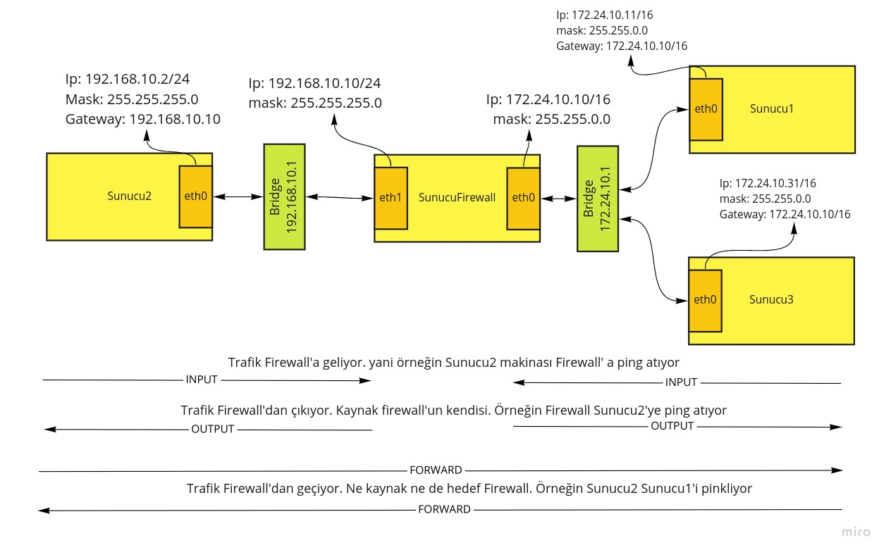

# Port Bloklamak

Herhangi bir ip veya network'ten belli portlardan gelen paket ve istekleri engellemek isteyebiliriz.





İki farklı durum için kural yazacağız
- Örneğin Sunucu1'den SunucuFirewall'a sadece 80 portundan erişilemesin diğer portlardan erişebilsin.
- SunucuFirewall üzerinde telnet (23) ve ssh (22) portlarına tüm networklerden erişimi engelmmek istiyoruz. Ancak bunun için iki kural yerine multiport modülünü kullanarak tek kural içinde 2 engellemeyi yapacağız.


### Tek Portu Engelleme Kuralının INPUT CHAIN'e Yazılması

SunucuFirewall makinası üzerinde alttaki kuralı yazıyoruz.

```shell
iptables -t filter -A INPUT -m tcp -p tcp -s 172.24.10.11 --dport 80 -j DROP
```
- m: tcp modülü
- p: tcp portu


Kuralı kontrol edecek olursak port numarasının da eklendiği görülecektir.

```shell
iptables -L -n

#sonuç
Chain INPUT (policy ACCEPT)
target     prot opt source               destination         
DROP       tcp  --  172.24.10.11         0.0.0.0/0            tcp dpt:80

Chain FORWARD (policy ACCEPT)
target     prot opt source               destination         

Chain OUTPUT (policy ACCEPT)
target     prot opt source               destination 
```

Kuralı yazdıktan sonra Sunucu1 dışında bütün makinalardan 80 portunun telnet ile çağırabildiği görülebilir.

Sunucu1 üzerinde telnet ile test yapıldığında uzunca bir süre beklettiği görülebilir. Wget veya curl ile test edecek olursak timeout verecektir. 

**Kuralı Silmek İçin**

-A yerine -D yazmamız yeterli

```shell
iptables -t filter -D INPUT -m tcp -p tcp -s 172.24.10.11 --dport 80 -j DROP
```
### İki veya Daha Dazla Portu Tek Kuralla Engelleme kuralının INPUT CHAIN'e Yazılması

SunucuFirewall üzerinde telnet (23) ve ssh (22) portlarına tüm networklerden erişimi engelmmek istiyoruz. Ancak bunun için iki kural yerine multiport modülünü kullanarak tek kural içinde 2 engellemeyi yapacağız.

Dikkat edilirse burada dport değil dports kullanıldı.

```shell
iptables -t filter -A INPUT -m multiport -p tcp -s 172.24.10.11 --dports 22,23 -j DROP
```
- m: multiport modülü
- p: tcp portu

Kontrol edecek olursak iki port görülebilir

```shell
iptables -L -n

#sonuç
Chain INPUT (policy ACCEPT)
target     prot opt source               destination         
DROP       tcp  --  172.24.10.11         0.0.0.0/0            multiport dports 22,23

Chain FORWARD (policy ACCEPT)
target     prot opt source               destination         

Chain OUTPUT (policy ACCEPT)
target     prot opt source               destination  
```
Yada şu şekilde de kontrol edebilirsiniz

```shell
iptables -L INPUT
#sonuç
Chain INPUT (policy ACCEPT)
target     prot opt source               destination         
DROP       tcp  --  client11.lxd         anywhere             multiport dports ssh,telnet

```

yada

```
iptables -L INPUT -n

#sonuç
Chain INPUT (policy ACCEPT)
target     prot opt source               destination         
DROP       tcp  --  172.24.10.11         0.0.0.0/0            multiport dports 22,23

```


Test etmek için telnet komutunda belli bir port belirtmezsek 23 portunu dinler yada açıkça 23 diye belirtebiliriz.


Sunucu1'de deneyecek olursak 23 portunu beklediğini görebiliriz. Hiç bir cevap dönmez.

```shell
lxc exec sunucu1 -- telnet 192.168.10.10 22
```


Sunucu3 de deneyecek olursak refused hatası alırız tabi ssh server kurulu değilse. Ancak kurulu olduğu için Sunucu3 den paketleri aldık

```
lxc exec sunucu3 -- telnet 192.168.10.10 22

#sonuç
Trying 192.168.10.10...
Connected to 192.168.10.10.
Escape character is '^]'.
SSH-2.0-OpenSSH_8.4p1 Ubuntu-5ubuntu1
```

### Pink Pakatlerini Bloklamak

Ping attığımızda iki cihaz arasında giden paketlere ICMP paketi diyoruz.

ICMP : Internet Connection Messaging Protocol


İki durumu test ediyor olacağız.

- SunucuFirewall'a gelen ICMP paketlerini engelleyeceğiz.
- Sunucu2'den SunucuFirewall'a ping attığımızda gitmeyecek. Bu beklediğimiz bir sonuç ancak bizim amacımız SunucuFirewall'dan Sunucu2'ye atılan ping'lere cevap alabilmekti. 


SunucuFirewall'da alttaki komutu çalıştırıp Sunucu2'den test ediyoruz.

```bash
iptables -A INPUT -p icmp -j DROP
```

Sunucu2'den ping atıyoruz. Görüleceği üzere paketlerin hepsi kayboldu.

```
ping 192.168.10.10

#sonuç
lxc exec c2  -- ping 192.168.10.10 
PING 192.168.10.10 (192.168.10.10) 56(84) bytes of data.
From 192.168.10.2 icmp_seq=1 Destination Host Unreachable
From 192.168.10.2 icmp_seq=2 Destination Host Unreachable
From 192.168.10.2 icmp_seq=3 Destination Host Unreachable
From 192.168.10.2 icmp_seq=4 Destination Host Unreachable
From 192.168.10.2 icmp_seq=5 Destination Host Unreachable
From 192.168.10.2 icmp_seq=6 Destination Host Unreachable
From 192.168.10.2 icmp_seq=7 Destination Host Unreachable
From 192.168.10.2 icmp_seq=8 Destination Host Unreachable
From 192.168.10.2 icmp_seq=9 Destination Host Unreachable
^C
--- 192.168.10.10 ping statistics ---
11 packets transmitted, 0 received, +9 errors, 100% packet loss, time 10222ms
pipe 4
```

Şimdi SunucuFirewal'dan Sunucu2'ye ping atalım. Uzunca bir süre böyle beklediğini görebiliriz. Sebebi ise firewall'dan paket çıkıyor ama Sunucu2'den cevap dönemiyor.

```bash
lxc exec firewall -- ping 192.168.10.2
PING 192.168.10.2 (192.168.10.2) 56(84) bytes of data.
```

Çünkü icmp peketi ile biz SunucuFirewall üzerinden echo-request alıyoruz ve karşıdan (Sunucu2) echo-reply bekliyoruz ancak bu bize dönmüyor. Şimdi bunu düzeltelim.

Bunun için öncelikle SunucuFirewall üzerinden eski kuralı siliyoruz

```bash
iptables -D INPUT -p icmp -j DROP
```

yenisini şu şekilde yazıyoruz

```bash
iptables -A INPUT -p icmp --icmp-type echo-request -j DROP

```

artık SunucuFirewall dan sunucu2'ye ping attığımızda geri dönüş alabildiğimizi görebiliriz. 

```bash
ping 192.168.10.2PING 192.168.10.2 (192.168.10.2) 56(84) bytes of data.
64 bytes from 192.168.10.2: icmp_seq=1 ttl=63 time=0.107 ms
64 bytes from 192.168.10.2: icmp_seq=2 ttl=63 time=0.129 ms
64 bytes from 192.168.10.2: icmp_seq=3 ttl=63 time=0.142 ms
^C
--- 192.168.10.2 ping statistics ---
3 packets transmitted, 3 received, 0% packet loss, time 2030ms
rtt min/avg/max/mdev = 0.107/0.126/0.142/0.014 ms
```

- https://www.frozentux.net/iptables-tutorial/iptables-tutorial.html
- https://linux.die.net/man/8/iptables
- https://askubuntu.com/questions/1052919/iptables-reload-restart-on-ubuntu-18-04
- https://unix.stackexchange.com/questions/345212/permission-denied-when-saving-iptable-rules-in-debian-8/345213
- https://medium.com/@gokhansengun/iptables-nedir-nas%C4%B1l-ve-nerelerde-kullan%C4%B1l%C4%B1r-1-7c081a9512c0
- https://medium.com/@gokhansengun/iptables-nedir-nas%C4%B1l-ve-nerelerde-kullan%C4%B1l%C4%B1r-2-5178c5560bb
