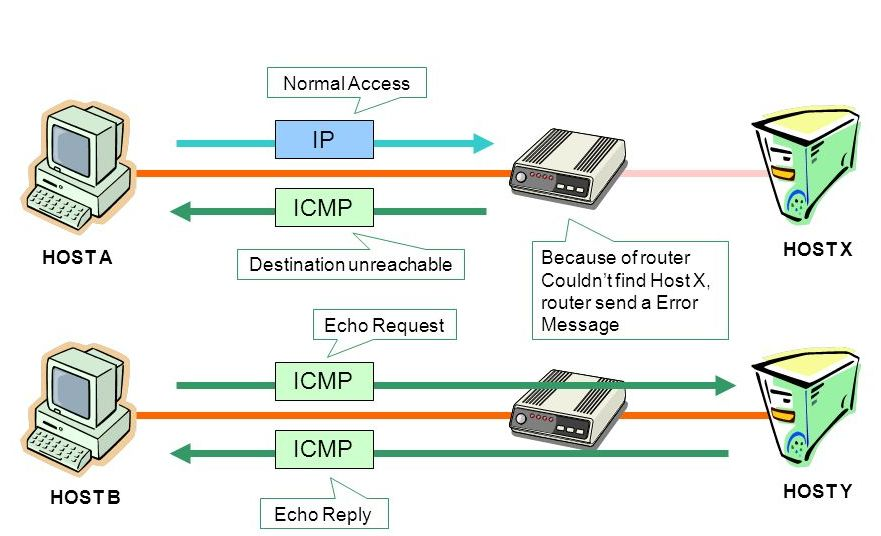
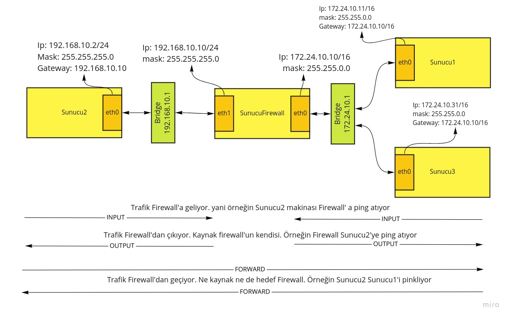
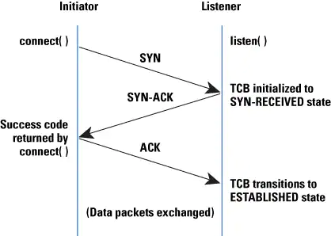

### Ping Pakatlerini Bloklamak

Ping attığımızda iki cihaz arasında giden paketlere ICMP paketi diyoruz.

Bir cihaz üzerinden karşı cihaza request (istek) paketi gider ve karşıdan da reply (cevap) döner. Eğer aradaki cihazlardan biri hedef cihaza ulaşamazsa **unreachable** hatası alırız.



ICMP : Internet Connection Messaging Protocol


İki durumu test ediyor olacağız.

- SunucuFirewall'a gelen ICMP paketlerini engelleyeceğiz.
- Sunucu2'den SunucuFirewall'a ping attığımızda gitmeyecek. Bu beklediğimiz bir sonuç ancak bizim amacımız SunucuFirewall'dan Sunucu2'ye atılan ping'lere cevap alabilmekti. 





SunucuFirewall'da alttaki komutu çalıştırıp Sunucu2'den test ediyoruz.

```bash
iptables -A INPUT -p icmp -j DROP
```

Sunucu2'den ping atıyoruz. Görüleceği üzere paketlerin hepsi kayboldu.

```
ping 192.168.10.10

#sonuç
lxc exec c2  -- ping 192.168.10.10 
PING 192.168.10.10 (192.168.10.10) 56(84) bytes of data.
From 192.168.10.2 icmp_seq=1 Destination Host Unreachable
From 192.168.10.2 icmp_seq=2 Destination Host Unreachable
From 192.168.10.2 icmp_seq=3 Destination Host Unreachable
From 192.168.10.2 icmp_seq=4 Destination Host Unreachable
From 192.168.10.2 icmp_seq=5 Destination Host Unreachable
From 192.168.10.2 icmp_seq=6 Destination Host Unreachable
From 192.168.10.2 icmp_seq=7 Destination Host Unreachable
From 192.168.10.2 icmp_seq=8 Destination Host Unreachable
From 192.168.10.2 icmp_seq=9 Destination Host Unreachable
^C
--- 192.168.10.10 ping statistics ---
11 packets transmitted, 0 received, +9 errors, 100% packet loss, time 10222ms
pipe 4
```

Şimdi SunucuFirewal'dan Sunucu2'ye ping atalım. Uzunca bir süre böyle beklediğini görebiliriz. Sebebi ise firewall'dan paket çıkıyor ama Sunucu2'den cevap dönemiyor.

```bash
lxc exec firewall -- ping 192.168.10.2
PING 192.168.10.2 (192.168.10.2) 56(84) bytes of data.
```

Çünkü icmp peketi ile biz SunucuFirewall üzerinden echo-request alıyoruz ve karşıdan (Sunucu2) echo-reply bekliyoruz ancak bu bize dönmüyor. Şimdi bunu düzeltelim.

Bunun için öncelikle SunucuFirewall üzerinden eski kuralı siliyoruz

```bash
iptables -D INPUT -p icmp -j DROP
```

yenisini şu şekilde yazıyoruz

```bash
iptables -A INPUT -p icmp --icmp-type echo-request -j DROP

```

artık SunucuFirewall dan sunucu2'ye ping attığımızda geri dönüş alabildiğimizi görebiliriz. 

```bash
ping 192.168.10.2PING 192.168.10.2 (192.168.10.2) 56(84) bytes of data.
64 bytes from 192.168.10.2: icmp_seq=1 ttl=63 time=0.107 ms
64 bytes from 192.168.10.2: icmp_seq=2 ttl=63 time=0.129 ms
64 bytes from 192.168.10.2: icmp_seq=3 ttl=63 time=0.142 ms
^C
--- 192.168.10.2 ping statistics ---
3 packets transmitted, 3 received, 0% packet loss, time 2030ms
rtt min/avg/max/mdev = 0.107/0.126/0.142/0.014 ms
```

### Yönlü Filtreleme 

Diyelimki Sunucu2'den SunucuFirewall'a telnet yapılmasını engellemek istiyoruz. Bunun için firewall üzerinde alttaki gibi bir kural yazdık

```bash
iptables -t filter -A INPUT -p tcp -s 192.168.10.2 -j DROP
```


Ancak bu durumda SunucuFirewall'dan Sunucu2'ye telnet de kapanmış oluyor. Aynı icmp paketlerinde olduğu gibi burada da gidiş ve dönüş taraflarına göre kural yazmamız gerekiyor. 



Connection Establishment

Kaynak : [Wiki](https://en.wikipedia.org/wiki/Transmission_Control_Protocol)


**3 Way Handshake**

- "SunucuFirewall" "syn" paketini "Sunucu2" ye gönderir 
- "Sunucu2" "syn, ack" paketini "SunucuFirewall" a geri gönderir
- "SunucuFirewall" "ack" paketini "Sunucu2" ye gönderir.


SunucuFirewall Sunucu2'ye telnet yaptığında  ilk adım çalışır fakat 2 adım engellemeden dolayı çalışmaz timeout a uğrar. Bu nedenle kuralımızı alttaki gibi değiştirmeliyiz.

```
iptables -t filter -A INPUT -p tcp --syn -s 192.168.10.2 -j DROP

```

Bu problemi bağlantı takibi (connection tracking) ile de çözebiliriz. Bir sonraki yazımızda tam olarak bu konu olacak zaten.

İyi okumalar


### Kaynaklar
- https://www.hostinger.web.tr/rehberler/iptables-rehberi
- https://en.wikipedia.org/wiki/Iptables
- https://www.frozentux.net/iptables-tutorial/iptables-tutorial.html
- https://linux.die.net/man/8/iptables
- https://askubuntu.com/questions/1052919/iptables-reload-restart-on-ubuntu-18-04
- https://unix.stackexchange.com/questions/345212/permission-denied-when-saving-iptable-rules-in-debian-8/345213
- https://medium.com/@gokhansengun/iptables-nedir-nas%C4%B1l-ve-nerelerde-kullan%C4%B1l%C4%B1r-1-7c081a9512c0
- https://medium.com/@gokhansengun/iptables-nedir-nas%C4%B1l-ve-nerelerde-kullan%C4%B1l%C4%B1r-2-5178c5560bb
- https://www.netfilter.org/documentation/HOWTO/packet-filtering-HOWTO-7.html
- https://www.linuxtopia.org/Linux_Firewall_iptables/x6231.html
- https://web.mit.edu/rhel-doc/4/RH-DOCS/rhel-rg-en-4/s1-iptables-options.html
- https://www-uxsup.csx.cam.ac.uk/pub/doc/redhat/redhat8/rhl-rg-en-8.0/s1-iptables-options.html
- https://www.tecmint.com/linux-iptables-firewall-rules-examples-commands/